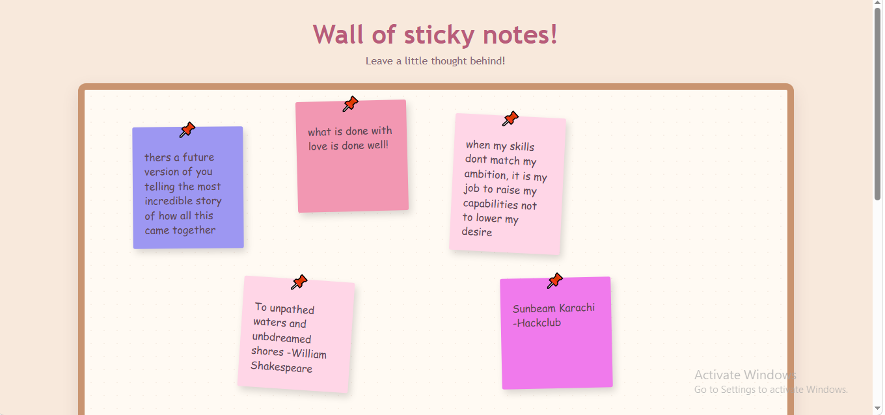
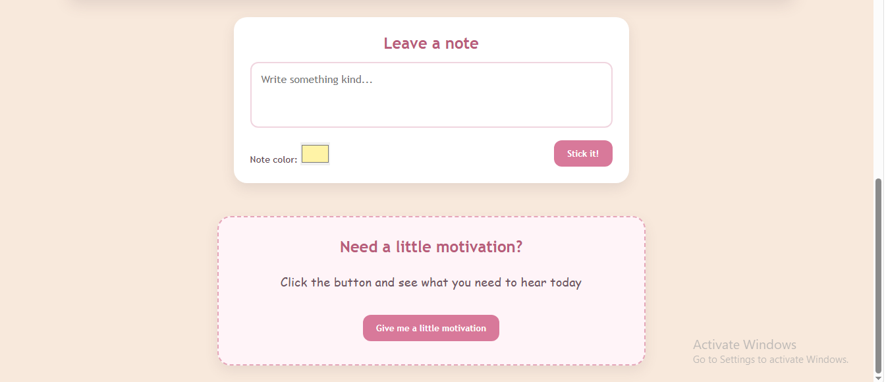

# Sticky Notes Wall

A cute, interactive digital bulletin board where you can leave motivational messages, create colorful Post-it notes, and arrange them however you like.

Or you can generate a random motivational quote and stick it straight onto your wall.

---

## Features

*  **Create Post-it Notes** — Write your own messages.
*  **Custom Note Colors** — Choose the color of every note.
*  **Pushpin Design** — Each note looks like it's actually pinned to the wall.
*  **Drag & Drop** — Move your notes around the wall freely.
*  **Delete Notes** — Remove notes whenever you want.
*  **Persistent Storage** — Notes are saved using browser `localStorage`, so they remain after refreshing the page.
*  **Random Positions & Rotation** — New notes are placed naturally around the wall.
*  **Motivation Generator** — Generate a random motivational quote when you need a little encouragement.
*  **One-Click Quotes** — Stick generated quotes directly onto the wall.

---

## 🛠️ Built With

* **HTML5** — Page structure and content
* **CSS3** — Styling, layout, animations, and responsive design
* **JavaScript** — Note creation, dragging, deletion, random quotes, and interactions
* **LocalStorage** — Saving notes directly in the browser
* **Git & GitHub** — Version control and project hosting

---

Made with 💗 for HackClub.
